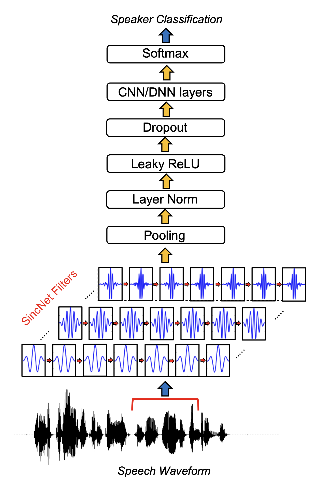

# PASE(Problem Agnostic Speech Encoder)

SincNet을 기본으로하는 아키텍처

음성 feature를 추출하는 뉴럴넷 가운데 하나

## SincNet

 

 

뉴럴네트워크 기반 feature 추출 기법

특징

- sinc function으로 만든 convolution filter를 모델의 첫번째 레이어로 사용함 
- 이 필터는 원본 음성(raw waveform)에서 task 수행에 중요한 주파수 영역대 정보를 추출해 상위 레이어로 보냄
- 

 

---------

## Reference

- https://arxiv.org/pdf/1904.03416.pdf
- https://arxiv.org/pdf/1812.05920.pdf
- https://ratsgo.github.io/speechbook/docs/neuralfe/pase
- https://ratsgo.github.io/speechbook/docs/neuralfe/sincnet