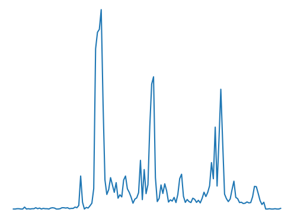
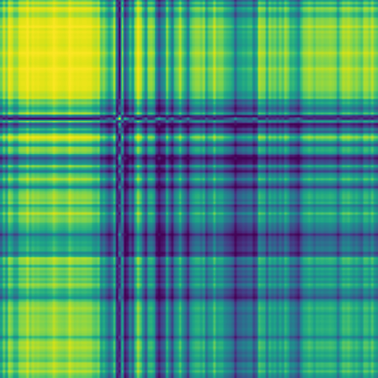
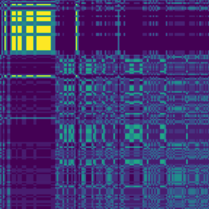
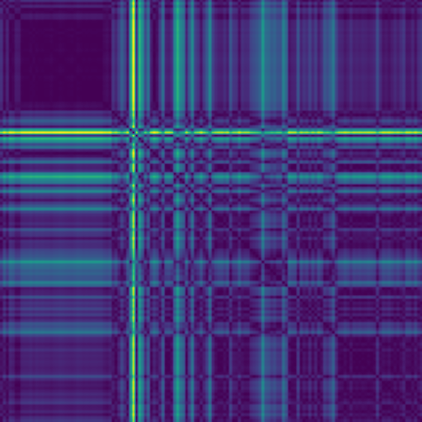

# Actigraphy Step 이미지화

시계열의 이미지화(time series encoding)

- 세분화된 L1길이의 시계열들은 L2xL2 크기의 이미지로 변환시킴


### pyts

- 시계열 변환 및 분류를 위한 python 패키지


<br/>

샘플 이미지



<br/>


<br/>

1. **Gramian Angular Field**

   1. ```python
      import numpy as np
      import pandas as pd
      import matplotlib
      import matplotlib.pyplot as plt
      from pyts.image import GramianAngularField
      
      matplotlib.rcParams['savefig.pad_inches'] = 0
      
      df = pd.read_csv("./data/10min/1.csv")
      df = df[['time', 'Step_10m_sum']]
      
      arr = np.array(df.groupby('time').median()['Step_10m_sum'].tolist())
      
      transformer = GramianAngularField()
      rp = transformer.transform(arr.reshape(1, -1))[0]
      
      plt.imshow(rp)
      plt.tight_layout()
      plt.axis('off')
      plt.show()
      ```

   2. shape=(144, 144)

      

   <br/>

2. **Markov Transition Field**

   1. ```
      import numpy as np
      import pandas as pd
      import matplotlib
      import matplotlib.pyplot as plt
      from pyts.image import GramianAngularField
      
      matplotlib.rcParams['savefig.pad_inches'] = 0
      
      df = pd.read_csv("./data/10min/1.csv")
      df = df[['time', 'Step_10m_sum']]
      
      arr = np.array(df.groupby('time').median()['Step_10m_sum'].tolist())
      
      transformer = GramianAngularField()
      rp = transformer.transform(arr.reshape(1, -1))[0]
      
      plt.imshow(rp)
      plt.tight_layout()
      plt.axis('off')
      plt.show()
      ```

   2. shape=(144, 144)

      

   <br/>

3. **Recurrence Plot**

   ```python
   import numpy as np
   import pandas as pd
   import matplotlib
   import matplotlib.pyplot as plt
   from pyts.image import RecurrencePlot
   
   matplotlib.rcParams['savefig.pad_inches'] = 0
   
   df = pd.read_csv("./data/10min/1.csv")
   df = df[['time', 'Step_10m_sum']]
   
   arr = np.array(df.groupby('time').median()['Step_10m_sum'].tolist())
   
   transformer = RecurrencePlot()
   rp = transformer.transform(arr.reshape(1, -1))[0]
   
   plt.imshow(rp)
   plt.tight_layout()
   plt.axis('off')
   plt.show()
   ```

   1. shape=(144, 144)

      

   2. https://pyts.readthedocs.io/en/stable/generated/pyts.image.RecurrencePlot.html

   <br/>

4. Gray Scale Encoding

   <br/>

5. Spectrogram

   <br/>

6. Scalogram

   <br/>


<br/>

--------------

<br/>

### Reference

- https://dodonam.tistory.com/281

