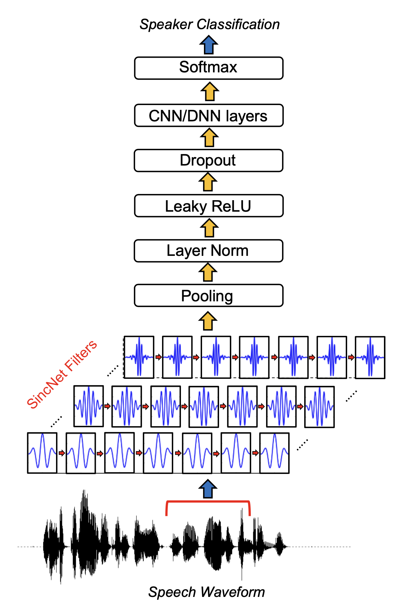

# 음성 특징(feature) 추출 관련 조사

 

## PASE(Problem Agnostic Speech Encoder) or PASE+

음성 feature를 추출하는 뉴럴넷 가운데 하나로 SincNet을 기본으로하는 아키텍처

 

PASE 구조

- 인코더(encoder)
  -  SincNet
  - ConvBlocks
  - Linear
  - Batch Normalization
- 워크(worker)
  - waveform, MFCC 등

 

 

### PASE+

PASE+ : PASE 대비 워커의 종류가 늘었고, 인코더의 구조가 개선됨

 

 

### Encoder

 

 

Speech distortion

- 강건한(robust) feature 추출기를 만들기 위해 각종 노이즈 추가

SincNet

- SincConv (1D conv)

ConvNet

- 7개의 1D conv
- 역할: 원시 음성의 경우 길이가 매우 길므로 컨볼루션 필터와 stride 등을 사용하여 그 길이를 줄임

QRNN(Quasi-Recurrent Neural Network)

- 

skip connection

Fully Connected Layer

batch normalization

 

#### Speech Distortion

6 가지 노이즈 추가 기법 사용

일반화(generalization) 성능 향상됨

- Reverberation: 잔향(Reverberation)은 소리를 내고 있다가 소리를 끊었을 때 해당 소리가 차츰 감쇄해 가는 현상임, 입력 음성에 잔향이 발생한 것처럼 노이즈를 추가 
- Additive Noise: 알람, 노크 등 노이즈를 더해(add) 입력 음성에 추가
- Frequency Mask: 입력 음성의 특정 주파수 밴드를 제거
- Temporal Mask: 입력 음성의 연속 샘플을 0으로 치환(=특정 시간대 제거)
- Clipping: 입력 음성 샘플을 랜덤하게 제거
- Overlap Speech: 입력 음성과 다른 음성을 더해 노이즈를 추가

 

#### Worker

regression 또는 binary classification을 수행함

워커는 인코더를 학습하기 위한 용도로, 학습이 끝난 후 제거하고 인코더만 음성 피처 추출기로 사용함

7가지 워커가 있음 (회귀: 5가지, 분류: 2가지)

- Wave
  - 입력 음성으로 복원
  - 입력과 출력 사이의 MSE(Mean Squared Error)를 최소화하는 방향으로 모델을 업데이트함
- Log Power Spectrum
  - 입력 음성의 Log Power Spectrum으로 변환
  - 입력과 출력의 Log Power Spectrum 사이의 MSE를 최소화하는 방향으로 모델을 업데이트함

- MFCC
  - 입력 음성의 MFCC로 변환
  - 입력과 출력의 MFCC 사이의 MSE를 최소화하는 방향으로 모델을 업데이트함

- FBANK
  - 입력 음성의 Filter Bank로 변환
  - 입력과 출력의 Filter Bank 사이의 MSE를 최소화하는 방향으로 모델을 업데이트함

- GAMMA
  - 입력 음성의 Gammatone feature로 변환
  - 입력과 출력의 Gammatone feature 사이의 MSE를 최소화하는 방향으로 모델을 업데이트함

- Prosody features
  - 입력 음성의 prosody feature로 변환
  - prosody feature는 음성의 강세, 억양 등에 영향을 주는 값
  - 음성 프레임 단위로 prosody feature 추출 가능
  - prosody feature에는 해당 프레임 기본 주파수(fundamental frequency)의 로그값, voiced/unvoiced 확률, zero-crossing rate, 에너지(energy) 등이 있음
  - 입력과 출력의 prosody feature 사이의 MSE를 최소화하는 방향으로 모델을 업데이트함

- Local Info Max
  - 포지티브 샘플은 앵커 샘플과 같은 문장에서 랜덤으로 추출
  - 네거티브 샘플은 앵커 샘플과 다른 배치에서 랜덤으로 추출
  - 포지티브 샘플은 앵커 샘플과 동일한 화자(speaker), 네거티브 샘플은 다른 화자일 가능성이 높음
  - LIM 워커는 PASE+ 인코더로 하여금 화자를 구분하는 능력을 부여해 줌
- Global Info Max
  - 앵커 샘플은 랜덤으로 뽑되 2초 간의 PASE+ 프레임 벡터의 평균을 취함
  - 포지티브 샘플은 앵커와 같은 문장에서 뽑되 2초 간 평균을 취함
  - 네거티브 샘플은 앵커와 동일한 배치 내 다른 문장에서 뽑되 2초 간 평균임
  - GIM 워커는 문장의 경계를 인식하게 함

 

## SincNet

 

 

뉴럴네트워크 기반 feature 추출 기법

특징

- sinc function으로 만든 convolution filter를 모델의 첫번째 레이어로 사용함 
- 이 필터는 원본 음성(raw waveform)에서 task 수행에 중요한 주파수 영역대 정보를 추출해 상위 레이어로 보냄
- 

 

## MFCC(Mel-Frequency Cepstral Coefficients)

 

## 기타 참고 조사

라이브러리

openSMILE

- 음성관련 의학 논문에서 많이 사용되는 라이브러리
- sound 관련 다양한 음성 특성변수(feature) set이 사전 정의(pre-defined)되어 있음

 

---------

## Reference

- https://arxiv.org/pdf/1904.03416.pdf
- https://arxiv.org/pdf/1812.05920.pdf
- https://ratsgo.github.io/speechbook/docs/neuralfe/pase
- https://ratsgo.github.io/speechbook/docs/neuralfe/sincnet